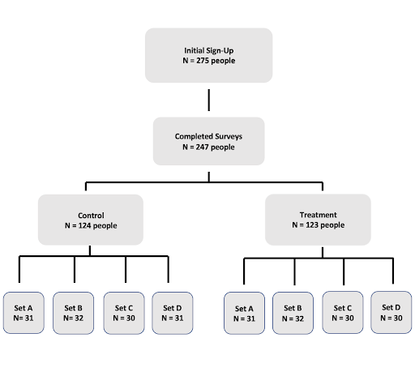

All About Attraction: Does Working at Trader Joe’s Increase Your
Attractiveness?
================
Josh Archer, Hannah Choi, Josh Lin, Pauline Yue


## Abstract

This study seeks to investigate how working at Trader Joe’s affects
one’s attractiveness. Our null hypothesis was that working at Trader
Joe’s does not influence an individual’s attractiveness, and our
alternative hypothesis is that it does. For this research, we
implemented a survey design in which we asked participants to choose
between two photos of individuals, for a total of 14 pairs. We obtained
247 completed responses, and we conducted several linear regression
models on our data. In the end, we were unable to reject the null
hypothesis, as we did not find our results to be statistically
significant. Nonetheless, we feel that our study begs further research
to better understand how people define attraction.

## Background

Over the years, Trader Joe’s has become more than just a place to get
groceries, but rather an experience in itself. From tropical island
themed interior and uniforms for their employees, to unique products
only found at Trader Joe’s, the brand has a competitive edge in the
grocery industry. The culture around the store has allowed it to develop
a cult following of customers who rave about their products. More
recently, there has been increasing attention towards the store’s
employees and the general opinion that Trader Joe’s workers are more
attractive than the average individual.

Based on this observed social phenomenon, we conducted an experiment to
test this hypothesis. We are interested if a person’s place of work
really has an effect on their attractiveness, because we recognize that
part of an individual’s image is defined (for better or worse) by their
professional role.

## Research Question & Hypothesis

Our research question is: Does working at Trader Joe’s make you more
attractive? We measured and compared ‘attractiveness’ of the subjects by
counting the number of times a photo was chosen in treatment (with a
logo) versus the number of times the photo was chosen in control
(without a logo).

Our *null hypothesis* is that working at Trader Joe’s has no effect on
how attractive a person is, and our *alternative hypothesis* is that
working at Trader Joe’s has an effect on how attractive a person is.
Based on our own experiences at Trader Joe’s we expect there will be a
positive impact of treatment on attractiveness. We also had an
additional sub-question in which we were interested in studying the
effect of smiling on attraction. Our null hypothesis for this
sub-question is that smiling has no effect on attraction, and our
alternative hypothesis is that smiling does have an effect.

## Experiment/Research Design

### Study Design

For our study, we implemented a survey in which participants swipe
through various pairs of photos and choose the individual they are more
attracted to. We obtained photos from our personal circle of friends,
and we attempted to maintain a wide array of individuals in our photo
sample. In total, we received 30 photos from 15 female-identifying
folks, and 36 photos from 19 male-identifying folks.

#### Pilot Study

We designed a pilot study (n=50) similar to our experimental survey that
featured the same swipe design. We distributed the pilot study via
Amazon Mechanical Turk first to determine how long it would take
participants to finish the survey and what feedback they might give in
response to our free response question to help us improve our final
iteration. We read through the free responses to determine which choices
we would include in the main study questions about physical and
personality traits.

#### Main Study

We then posted our final survey through Amazon Mturk. In the final
survey, all participants (n = 247) were prompted to choose who they
found more attractive between a total of 14 pairs of individuals (14
male and 14 female) in a single-blind study. Two multiple choice
questions appear after the selection asking what physical trait (smile,
body type, hair, or eyes) and personality trait (kind, fun, adventurous,
hardworking, or trustworthy) motivated their selection the most. We
chose these answer choices based on the responses of the open-ended
version of those questions in the pilot survey. At the end of the survey
we asked the same 2 questions with regards to an ideal partner in order
to see if that criteria stayed the same throughout the survey. In total,
the questions across all surveys remained the same with the variation
being the pairs and type of image used for each subject.

### Treatment

The baseline for all photos was an individual wearing a monochrome shirt
visible from the waist-up. The treatment in this study is the placement
of a logo on a subject’s t-shirt- the original photo altered with either
a Trader Joe’s and Nike logo prominently placed. This design created 6
iterations of an individual (smiling with no logo, smiling with Trader
Joe’s, smiling with Nike, non-smiling with no logo, non-smiling with
Trader Joe’s, and non-smiling with Nike; see Figures 1-6 in Appendix A
for example images). Although the main goal of our experiment was to see
if the presence of a Trader Joe’s logo would make an individual more
attractive, we also included the Nike logo to see if there was an
overall effect of a logo on one’s attractiveness. It also served as a
means to maintain the single-blind nature of our study so that
respondents would not infer that we were testing for the effect of a
Trader Joe’s affiliation on attractiveness. Furthermore, we wanted to
see if smiling had an effect on attraction, and thus added smiling as a
feature and potential covariate.

### Randomization engineering

We created 4 sets of control and treatment survey versions-control A,
treatment A, control B, treatment B, control C, treatment C, control D,
and treatment D. Within each set of treatment and control groups the
same pairs and baseline photos were utilized, and only the treatment
groups saw the introduction of a logo. The pairs and what type of logo
(none, Trader Joe’s, or Nike) an individual would have were randomly
generated. We implemented the randomizer function within Qualtrics to
ensure that the question blocks with photographs would randomly present
evenly across the survey distribution. There were 30-32 respondents in
each survey group (see consort document below). We also used tools in
Qualtrics to enable each of the question choices to appear in a random
order, to minimize the possible human error of participants simply just
clicking through the survey. Randomization of the pairings was crucial
to ensure that an individual with a baseline attractiveness objectively
higher than others did not overshadow the effect of the logos.



### Experimental materials (e.g. treatment materials)

The subjects of our study were 19 males and 15 females who volunteered
to have their photos taken to be put in our surveys. Their photos were
taken from the waist up, in a plain, solid color t-shirt, with
variations of smiling or not smiling. Their t-shirts were kept plain so
that we could either use that photo as a control, or photoshop a Trader
Joe’s or Nike logo onto them as treatment. The outcome we measured was
the total number of times each photo was chosen.

Our study participants were Amazon Mechanical Turk workers who were
located in the United States, had a high approval rating (\> 90%), and a
high quantity of approvals (\> 50). We were able to receive a total of
247 completed responses to our survey. We were unable to view the
incomplete responses through Qualtrics and did not include them in our
analysis.

## Modeling Choices

For our analysis, we decided to use linear regression to test our
hypotheses. We were interested in regressing the total number of times a
picture was chosen on whether or not the photo contained a Trader Joe’s
logo. At first, we built a linear regression model that compared photos
that had a Trader Joe’s logo to all other photos-both photos that were
blank in both control and treatment and photos that contained a Nike
logo.

However, this is an unbalanced comparison since the photos with Trader
Joe’s logos were compared to all photos. Thus, we decided to compare the
photos in treatment with a TJs logo to the matching subset of photos in
control. There were 42 photos in treatment with a Trader Joe’s logo
which we matched with 42 of the same photos in control without the logo.
This resulted in a more accurate yet underpowered estimation of the
linear model.

In order to avoid confusing a “Trader Joe’s Logo” effect with a general
logo effect, we did a similar comparison for Nike photos. We matched the
39 photos in treatment with a Nike logo to their 39 counterparts in
control. We did not run this model to investigate a Nike logo effect,
but instead referenced this model to better understand the Trader Joe’s
Logo Effect. For example, if there was a positive treatment effect for
Trader joe’s treatment and Nike treatment, we might think there is a
general logo effect that is not specific to a Trader Joe’s logo.
However, as we will explore in the results section, the Trader Joe’s and
Nike logos have opposite estimated effects on outcomes.

## Results

``` r
par(mfrow=c(3,1))

hist(data[data$tjs_logo==1]$total_counts, xlab= "Total Times Chosen",
     main = "Distribution of Counts for Trader Joe's Photos")

hist(data[data$treat_ind==0]$total_counts, xlab= "Total Times Chosen",
     main = "Distribution of Counts for Blank Photos")

hist(data[data$nike_logo==1]$total_counts, xlab= "Total Times Chosen",
     main = "Distribution of Counts for Nike Photos")
```

<!-- -->

Figure 7 shows a distribution of the total counts of photos with a
Trader Joe’s logo chosen as the more attractive between two options.
There appears to be a relatively normal distribution that is slightly
skewed right. Figure 8 depicts a distribution of the total counts of
photos with no logo chosen as the more attractive between two options.
There is a bimodal distribution of the data, with values condensed at
both the lower and upper ends of the x axis. Figure 9 shows a
distribution of the total counts of photos with a Nike logo chosen as
the more attractive between two options. The distribution is relatively
uniform across all bins.

``` r
par(mfrow=c(2,1))

hist(data[data$smile_ind==1]$total_counts, xlab= "Total Times Chosen",
     main = "Distribution of Counts for Smiling Photos")

hist(data[data$smile_ind==0]$total_counts, xlab= "Total Times Chosen",
     main = "Distribution of Counts for Non-Smiling Photos")
```

<!-- -->

Figure 10 shows the distribution of the total counts of photos with the
individual smiling chosen as the more attractive between two options.The
distribution is non-symmetric. Figure 11 shows the distribution of the
total counts of photos with the individual not smiling chosen as the
more attractive between two options. The distribution is non-symmetric.

``` r
model_1 <- data[, lm(total_counts ~ tjs_logo)]
#coeftest(model_1, vcovHC(model_1))
```

``` r
model_2 <- data[, lm(total_counts ~ tjs_logo + survey_block)]
#coeftest(model_2, vcovHC(model_2))
anova(model_1, model_2, test= 'F')
```

    ## Analysis of Variance Table
    ## 
    ## Model 1: total_counts ~ tjs_logo
    ## Model 2: total_counts ~ tjs_logo + survey_block
    ##   Res.Df   RSS Df Sum of Sq      F Pr(>F)
    ## 1    222 34226                           
    ## 2    219 34192  3    33.829 0.0722 0.9748

``` r
model_3 <- data[nike_logo ==  0, lm(total_counts ~ tjs_logo)]
#coeftest(model_3, vcovHC(model_3))
```

``` r
model_4 <- data[, lm(total_counts ~ tjs_logo + smile_ind)]
#coeftest(model_4, vcovHC(model_4))
anova(model_1, model_4, test = 'F')
```

    ## Analysis of Variance Table
    ## 
    ## Model 1: total_counts ~ tjs_logo
    ## Model 2: total_counts ~ tjs_logo + smile_ind
    ##   Res.Df   RSS Df Sum of Sq      F Pr(>F)
    ## 1    222 34226                           
    ## 2    221 34190  1    35.962 0.2325 0.6302

In model 1 (as seen in the below table), we regressed the total number
of times a photo was chosen on whether or not the photo contained a
Trader Joe’s Logo. We found that the estimated effect of having a Trader
Joe’s logo on the times a photo was chosen was negative, -1.945 (robust
standard errors = 1.512), and was not statistically significant. Since
the standard errors are almost the same magnitude as the estimated
effect, it is also difficult to determine if there is any practical
significance.

In model 2, although the F-test p-value is almost 1 (as seen in the
above F-test), looking at this second baseline model, we can see that
our randomization was successful, since we did not see within-survey
group effects. In other words, our treatment fulfilled the randomization
principle in that we were comparing apples to apples. In model 3, we
chose not to include any photos that included a Nike logo to
specifically compare blank photos to Trader Joe’s logo photos. Here we
can see that the effect is still negative, but not as pronounced.
However, the standard errors were even larger, 1.648.

In model 4, we wanted to investigate our sub-question. We can see that
having a smile has a slightly estimated positive effect, but the slope
coefficient, 0.804, was not statistically significant with large
standard errors (1.675). Of note, we did observe that some of the photos
we received for the non-smile category did ambiguously look like they
were smiling. Therefore, it is possible that this lack of uniformity
across photos diluted the effect we observed.

``` r
stargazer(model_1, model_2, model_3, model_4, type = 'text', 
          se = list(robust_se(model_1),robust_se(model_2), robust_se(model_3), robust_se(model_4)),
          column.labels = c('Model 1', 'Model 2', 'Model 3', 'Model 4'),
          dep.var.labels = c('Total Number of Times Chosen'),
          covariate.labels = c("Trader Joe's Logo", 'Survey Block B', 
                               'Survey Block C', 'Survey Block D',
                              'Smile', 'Baseline'),
          title = "Table 1: Baseline Models")
```

    ## 
    ## Table 1: Baseline Models
    ## ===================================================================================================
    ##                                                   Dependent variable:                              
    ##                     -------------------------------------------------------------------------------
    ##                                              Total Number of Times Chosen                          
    ##                           Model 1             Model 2             Model 3             Model 4      
    ##                             (1)                 (2)                 (3)                 (4)        
    ## ---------------------------------------------------------------------------------------------------
    ## Trader Joe's Logo         -1.945              -1.975              -1.660              -1.929       
    ##                           (1.512)             (1.547)             (1.648)             (1.520)      
    ##                                                                                                    
    ## Survey Block B                                 0.641                                               
    ##                                               (2.356)                                              
    ##                                                                                                    
    ## Survey Block C                                -0.429                                               
    ##                                               (2.400)                                              
    ##                                                                                                    
    ## Survey Block D                                -0.109                                               
    ##                                               (2.329)                                              
    ##                                                                                                    
    ## Smile                                                                                  0.804       
    ##                                                                                       (1.675)      
    ##                                                                                                    
    ## Baseline                 15.802***           15.782***           15.517***           15.365***     
    ##                           (0.989)             (1.682)             (1.185)             (1.343)      
    ##                                                                                                    
    ## ---------------------------------------------------------------------------------------------------
    ## Observations                224                 224                 185                 224        
    ## R2                         0.004               0.005               0.003               0.005       
    ## Adjusted R2               -0.001              -0.013              -0.003              -0.004       
    ## Residual Std. Error  12.417 (df = 222)   12.495 (df = 219)   12.916 (df = 183)   12.438 (df = 221) 
    ## F Statistic         0.837 (df = 1; 222) 0.261 (df = 4; 219) 0.536 (df = 1; 183) 0.533 (df = 2; 221)
    ## ===================================================================================================
    ## Note:                                                                   *p<0.1; **p<0.05; ***p<0.01

``` r
# Remove nike logo photos and look for just tjs photos
interim <- data[logo != "nike"]
tjs_only <- data[logo == "tjs"]

# Create a join_id to combine tables later
photo_name_split <- read.table(text = interim[ , photo_block], sep = "_", as.is = TRUE, fill = TRUE)
interim[, join_id := paste(photo_name_split$V1, photo_name_split$V2, photo_name_split$V3, photo_name_split$V6, photo_name_split$V7, sep="_")]
interim[, gender := photo_name_split$V2]

## Subset needed columns and match control photos to tjs photos (not including photos that were blank in both control and treatment)
tjs_only <- interim[logo=="tjs"]
tjs_only <- tjs_only[ , c("photo_block", "join_id", "treat_ind", "survey_block", "total_counts", "smile_ind", "gender")]
rows_to_keep <- tjs_only[, join_id]
none_c_only <- interim[logo=="none" & treat_ind<1]
none_c_only <- none_c_only[ , c("photo_block", "join_id", "treat_ind", "survey_block", "total_counts", "smile_ind", "gender")]
none_c_matched <- subset(none_c_only, join_id %in% rows_to_keep)

# none_c_rows <- none_c_matched[, join_id]
# tjs_issue <- subset(tjs_only, !(join_id %in% none_c_rows))

# View(none_c_matched)
tjs_vs_control <- rbind(tjs_only, none_c_matched)
#View(tjs_vs_control)
```

``` r
#42 blanks and 42 with tj's
model_5 <- tjs_vs_control[, lm(total_counts ~ treat_ind)]
#coeftest(model_5, vcovHC(model_5))
```

``` r
model_6 <- tjs_vs_control[, lm(total_counts ~ treat_ind + smile_ind + treat_ind*smile_ind)]
#coeftest(model_6, vcovHC(model_6))
anova(model_5, model_6, test = 'F')
```

    ## Analysis of Variance Table
    ## 
    ## Model 1: total_counts ~ treat_ind
    ## Model 2: total_counts ~ treat_ind + smile_ind + treat_ind * smile_ind
    ##   Res.Df   RSS Df Sum of Sq      F Pr(>F)
    ## 1     82 12102                           
    ## 2     80 12072  2    29.301 0.0971 0.9076

``` r
model_7 <- tjs_vs_control[, lm(total_counts ~ treat_ind + gender + treat_ind*gender)]
#coeftest(model_7, vcovHC(model_7))
anova(model_5, model_7, test = 'F')
```

    ## Analysis of Variance Table
    ## 
    ## Model 1: total_counts ~ treat_ind
    ## Model 2: total_counts ~ treat_ind + gender + treat_ind * gender
    ##   Res.Df   RSS Df Sum of Sq      F Pr(>F)
    ## 1     82 12102                           
    ## 2     80 11976  2    125.68 0.4198 0.6586

``` r
model_gen_smile <- tjs_vs_control[, lm(total_counts ~ treat_ind + smile_ind + treat_ind*smile_ind
                                       + gender + treat_ind*gender + smile_ind*gender)]
#coeftest(model_gen_smile, vcovHC(model_gen_smile))
anova(model_5, model_gen_smile, test = 'F')
```

    ## Analysis of Variance Table
    ## 
    ## Model 1: total_counts ~ treat_ind
    ## Model 2: total_counts ~ treat_ind + smile_ind + treat_ind * smile_ind + 
    ##     gender + treat_ind * gender + smile_ind * gender
    ##   Res.Df   RSS Df Sum of Sq      F Pr(>F)
    ## 1     82 12102                           
    ## 2     77 11701  5    400.85 0.5276 0.7547

In the next set of models, we only focus on photos that were blank in
control and contained the Trader Joe’s logo in the treatment survey. As
discussed in the Modeling Choices section, we did so to see how our
outcome variable changed for the selected photos before and after
receiving a Trader Joe’s logo. In model 5 (as seen in the below table),
similar to before, we regressed the total number of times a photo was
chosen on whether or not the photo contained a Trader Joe’s Logo. We
found that the estimated effect of having a Trader Joe’s logo on the
times a photo was chosen was negative, -3.857 (robust standard errors =
2.683), and was not statistically significant. It is likely that the
estimated effect and standard errors are even larger because of our
smaller sample size for this model (n=84).

In model 6, we were interested in looking at the effect of having a
smile in the photo once again and the interaction with our primary
indicator variable. Here we see having a smile has a larger positive
effect than before, but the standard errors are even larger.
Interestingly, having a smile and a Trader Joe’s logo makes the effect
less negative than simply having a logo.

In model 7, we observe that the estimated effect of being shown a male
subject in the photo and the interaction term between having a logo and
the male gender were positive. It’s likely that the respondents overall
felt that certain male photo subjects were more attractive on average
compared to other photo subjects within the survey sets, and that
certain male photo subjects had a larger boost in their selection rates
due to the Trader Joe’s logo compared to the effect the logo had for
females.

In our saturated model, we see that having a Trader Joe’s logo still
reains negative, but the standard errors are even larger. We do note,
though, that in the above F-test, we see that this model has a large
p-value for the F-test, meaning that this model does not add any new
statistical information to Model 5. It is interesting still that the
interaction term between males and smiling is largely positive.

``` r
stargazer(model_5, model_6, model_7, model_gen_smile, type = 'text', 
          se = list(robust_se(model_5), robust_se(model_6), robust_se(model_7), 
                    robust_se(model_gen_smile)),
          column.labels = c('Model 5', 'Model 6', 'Model 7', 'Saturated Model'),
          dep.var.labels = c('Total Number of Times Chosen'),
          covariate.labels = c("Contains Logo", 'Smile', 
                               'Contains Logo*Smile', 'Male Photo Subject', "Contains Logo*Male",
                              'Smile*Male', 'Baseline'),
          title = "Table 2: Trader Joe's Only Models")
```

    ## 
    ## Table 2: Trader Joe's Only Models
    ## ===============================================================================================
    ##                                                 Dependent variable:                            
    ##                     ---------------------------------------------------------------------------
    ##                                            Total Number of Times Chosen                        
    ##                          Model 5            Model 6            Model 7        Saturated Model  
    ##                            (1)                (2)                (3)                (4)        
    ## -----------------------------------------------------------------------------------------------
    ## Contains Logo             -3.857             -2.850             -4.950             -3.947      
    ##                          (2.683)            (4.052)            (4.050)            (5.295)      
    ##                                                                                                
    ## Smile                                        1.650                                 -1.892      
    ##                                             (4.972)                               (6.041)      
    ##                                                                                                
    ## Contains Logo*Smile                          -1.923                                -1.823      
    ##                                             (5.509)                               (5.649)      
    ##                                                                                                
    ## Male Photo Subject                                              1.173              -2.346      
    ##                                                                (4.983)            (5.987)      
    ##                                                                                                
    ## Contains Logo*Male                                              2.086              1.995       
    ##                                                                (5.489)            (5.643)      
    ##                                                                                                
    ## Smile*Male                                                                         6.848       
    ##                                                                                   (5.672)      
    ##                                                                                                
    ## Baseline                17.714***          16.850***          17.100***          18.140***     
    ##                          (2.427)            (3.590)            (3.643)            (5.041)      
    ##                                                                                                
    ## -----------------------------------------------------------------------------------------------
    ## Observations                84                 84                 84                 84        
    ## R2                        0.025              0.028              0.035              0.057       
    ## Adjusted R2               0.013              -0.009             -0.001             -0.016      
    ## Residual Std. Error  12.148 (df = 82)   12.284 (df = 80)   12.235 (df = 80)   12.327 (df = 77) 
    ## F Statistic         2.117 (df = 1; 82) 0.755 (df = 3; 80) 0.976 (df = 3; 80) 0.782 (df = 6; 77)
    ## ===============================================================================================
    ## Note:                                                               *p<0.1; **p<0.05; ***p<0.01

``` r
interim <- copy(data)
photo_name_split <- read.table(text = interim[ , photo_block], sep = "_", as.is = TRUE, fill = TRUE)
interim[, join_id := paste(photo_name_split$V1, photo_name_split$V2, photo_name_split$V3, photo_name_split$V6, photo_name_split$V7, sep="_")]
interim[, gender := photo_name_split$V2]
# View(interim)

nike_only <- interim[logo=="nike"]
nike_only <- nike_only[ , c("photo_block", "join_id", "treat_ind", "survey_block", "total_counts", "smile_ind", "gender")]
rows_to_keep_nike <- nike_only[, join_id]
none_c_matched <- subset(none_c_only, join_id %in% rows_to_keep_nike)
# none_c_rows <- none_c_matched[, join_id]
# tjs_issue <- subset(tjs_only, !(join_id %in% none_c_rows))
# View(none_c_matched)
nike_vs_control <- rbind(nike_only, none_c_matched) # only has 39 blanks and 39 nike logo photos
```

``` r
model_8 <- nike_vs_control[, lm(total_counts ~ treat_ind)]
coeftest(model_8, vcovHC(model_8))
```

    ## 
    ## t test of coefficients:
    ## 
    ##             Estimate Std. Error t value  Pr(>|t|)    
    ## (Intercept)  11.8718     2.4687  4.8089 7.503e-06 ***
    ## treat_ind     4.9744     2.9355  1.6945   0.09426 .  
    ## ---
    ## Signif. codes:  0 '***' 0.001 '**' 0.01 '*' 0.05 '.' 0.1 ' ' 1

``` r
#interaction term not included because of perfect collinearity (potentially a product of randomization)
model_9 <- nike_vs_control[, lm(total_counts ~ treat_ind + smile_ind)]
#coeftest(model_9, vcovHC(model_9))
anova(model_8, model_9, test = 'F')
```

    ## Analysis of Variance Table
    ## 
    ## Model 1: total_counts ~ treat_ind
    ## Model 2: total_counts ~ treat_ind + smile_ind
    ##   Res.Df   RSS Df Sum of Sq      F Pr(>F)
    ## 1     76 12443                           
    ## 2     75 12440  1    3.2696 0.0197 0.8887

``` r
model_10 <- nike_vs_control[, lm(total_counts ~ treat_ind + gender + treat_ind*gender)]
#coeftest(model_10, vcovHC(model_10))
anova(model_8, model_10, test = 'F')
```

    ## Analysis of Variance Table
    ## 
    ## Model 1: total_counts ~ treat_ind
    ## Model 2: total_counts ~ treat_ind + gender + treat_ind * gender
    ##   Res.Df   RSS Df Sum of Sq      F Pr(>F)
    ## 1     76 12443                           
    ## 2     74 12420  2    23.978 0.0714 0.9311

``` r
model_nike_gen_smile <- nike_vs_control[, lm(total_counts ~ treat_ind + smile_ind
                                       + gender + treat_ind*gender)]
#coeftest(model_nike_gen_smile, vcovHC(model_nike_gen_smile))
anova(model_8, model_nike_gen_smile, test = 'F')
```

    ## Analysis of Variance Table
    ## 
    ## Model 1: total_counts ~ treat_ind
    ## Model 2: total_counts ~ treat_ind + smile_ind + gender + treat_ind * gender
    ##   Res.Df   RSS Df Sum of Sq      F Pr(>F)
    ## 1     76 12443                           
    ## 2     73 12416  3    27.408 0.0537 0.9835

In this case, as stated in the Modeling Choices, we performed linear
regression on the photos that were blank in control and treated with the
Nike logo as a robustness check. Therefore, we do not intend to make any
statements about the statistical or practical significance of the
effects observed in the following models. While the number of Nike logo
pairs is smaller (n=39), the overall ratio is almost the same, and
because of the similar proportion of photos pairs, we can infer that the
estimated effect we saw in the Trader Joe’s baseline model is unique to
the Trader Joe’s logo as they two slope coefficients are vastly
different. What we can learn then is that the effect we observed in the
previous set of models for the Trader Joe’s logo is not simply due to a
‘logo’ effect, or just adding any logo.

``` r
stargazer(model_8, model_9, model_10, model_nike_gen_smile, type = 'text', 
          se = list(robust_se(model_8), robust_se(model_9), robust_se(model_10), 
                    robust_se(model_nike_gen_smile)),
          column.labels = c('Model 8', 'Model 9', 'Model 10', 'Saturated Model'),
          dep.var.labels = c('Total Number of Times Chosen'),
          covariate.labels = c("Contains Logo", 'Smile', 'Male Photo Subject',
                               "Contains Logo*Male", 'Baseline'),
          title = "Table 3: Nike Only Models")
```

    ## 
    ## Table 3: Nike Only Models
    ## ================================================================================================
    ##                                                 Dependent variable:                             
    ##                     ----------------------------------------------------------------------------
    ##                                             Total Number of Times Chosen                        
    ##                           Model 8            Model 9            Model 10       Saturated Model  
    ##                             (1)                (2)                (3)                (4)        
    ## ------------------------------------------------------------------------------------------------
    ## Contains Logo             4.974*              4.974*             6.105              6.105       
    ##                           (2.936)            (2.975)            (4.467)            (4.531)      
    ##                                                                                                 
    ## Smile                                         0.421                                 0.432       
    ##                                              (3.079)                               (3.159)      
    ##                                                                                                 
    ## Male Photo Subject                                               0.982              0.951       
    ##                                                                 (5.068)            (5.148)      
    ##                                                                                                 
    ## Contains Logo*Male                                               -2.205             -2.205      
    ##                                                                 (6.037)            (6.120)      
    ##                                                                                                 
    ## Baseline                 11.872***          11.613***          11.368***          11.118***     
    ##                           (2.469)            (3.146)            (3.606)            (4.076)      
    ##                                                                                                 
    ## ------------------------------------------------------------------------------------------------
    ## Observations                78                  78                 78                 78        
    ## R2                         0.037              0.038              0.039              0.039       
    ## Adjusted R2                0.025              0.012              0.0002             -0.013      
    ## Residual Std. Error  12.796 (df = 76)    12.879 (df = 75)   12.955 (df = 74)   13.042 (df = 73) 
    ## F Statistic         2.947* (df = 1; 76) 1.464 (df = 2; 75) 1.006 (df = 3; 74) 0.750 (df = 4; 73)
    ## ================================================================================================
    ## Note:                                                                *p<0.1; **p<0.05; ***p<0.01

### Power Calculation

``` r
#Power calculation using model_6
summary(model_5)
```

    ## 
    ## Call:
    ## lm(formula = total_counts ~ treat_ind)
    ## 
    ## Residuals:
    ##     Min      1Q  Median      3Q     Max 
    ## -17.714  -9.357   1.143  12.286  16.143 
    ## 
    ## Coefficients:
    ##             Estimate Std. Error t value Pr(>|t|)    
    ## (Intercept)   17.714      1.875   9.450 9.17e-15 ***
    ## treat_ind     -3.857      2.651  -1.455    0.149    
    ## ---
    ## Signif. codes:  0 '***' 0.001 '**' 0.01 '*' 0.05 '.' 0.1 ' ' 1
    ## 
    ## Residual standard error: 12.15 on 82 degrees of freedom
    ## Multiple R-squared:  0.02517,    Adjusted R-squared:  0.01328 
    ## F-statistic: 2.117 on 1 and 82 DF,  p-value: 0.1495

``` r
effect_size <- 0.02517/(1-0.02517) #use multiple R-squared value from model 6 summary
pwr.f2.test(u = 1, v = 82, f2 = effect_size) #u and v come from DF from summary
```

    ## 
    ##      Multiple regression power calculation 
    ## 
    ##               u = 1
    ##               v = 82
    ##              f2 = 0.02581989
    ##       sig.level = 0.05
    ##           power = 0.3072778

To determine how much statistical power our final model (Model 5) had,
based on our model parameters, we found that our model had about 30.73%
statistical power. This means that our model only had 30.73% chance of
reporting a true positive result. Although the reported statistical
power is quite low, we feel that this level of power is understandable
given our small data size and the fact we were dealing with data related
to how humans think.

First, when we only focused on photos that were blank in control and
contained a Trader Joe’s logo in treatment, we only had 42 total unique
photo subjects. Therefore, we were comparing across 42 pairs, which is a
fairly small dataset. Second, when dealing with sociology- and
psychology-type questions like attraction, given the limitations of our
experimental design, we cannot fully capture how humans think using the
variables we had operationalized. Therefore, we argue that it is
reasonable that our statistical power is quite small.

## Limitations and Next Steps

Moving forward with our study, we indeed realize there is much more we
can do to iterate upon our experiment. If we were to rerun this
experiment, we first want to increase our sample size. While we were
able to work within our budget and time frame and obtain 247 responses,
our sample is still not entirely representative of the entire
population. Looking at the demographics, we do not have a fair number of
respondents from older and younger age groups, since our responses
mainly came from middle aged individuals. Aside from increasing the
sample size, we would also want to further randomize the order of the
photos and incorporate a mechanism for selected photos to reappear
within the question bank, as having respondents select through the
photos multiple times would allow us to hone in more closely at the true
treatment effect. We would also include more subjects for our photos so
that our photos better represent the population as well, since all our
subjects came from our circle of friends and, thus, primarily came from
a younger age group.

First, we believe that a larger variety of photo subjects would help to
increase the statistical power. In our current models, we calculate
statistical power based on the photo subjects, however for future
iterations we would want to draw on the responses and questions instead
of the photos. This would allow us to increase statistical power by
focusing on the respondents instead of the subjects, because we have a
much larger number of respondents (n=247) compared to photo subjects
(n=42, for Trader Joe’s).

Additionally, we would like to experiment with different research
designs. For instance, sending out several ‘mini’ surveys in which
respondents only see a single pair of photos. In this way, we can
measure our outcomes at the respondent level, rather than the photo
subject level. Another potential variation is showing respondents a
single photo at a time and asking them to ‘swipe’ yes or no on the
photo, more akin to modern dating apps like Tinder.

## Conclusion

All in all, we were unable to find statistically significant evidence
that working at Trader Joe’s affects an individual’s attractiveness.
However, we confirmed that our findings were not simply due to a ‘logo’
effect as seen in our robustness check with our Nike models. We also
found mixed evidence that smiles increase the attractiveness of an
individual. Despite this, we do believe there is more space for
additional research in this area, as our topic study is novel in this
domain and relevant in understanding the intricacies of modern day
attraction. We also would like to thank our colleague Julie Lai for
proposing this idea for our project.
